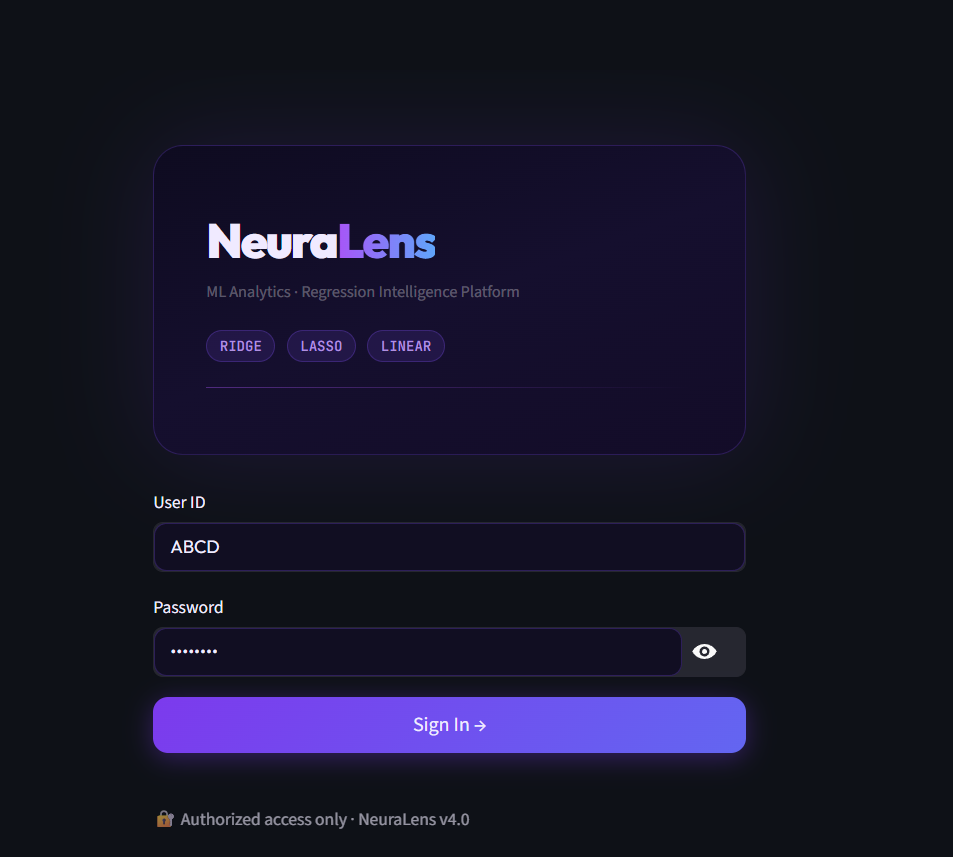
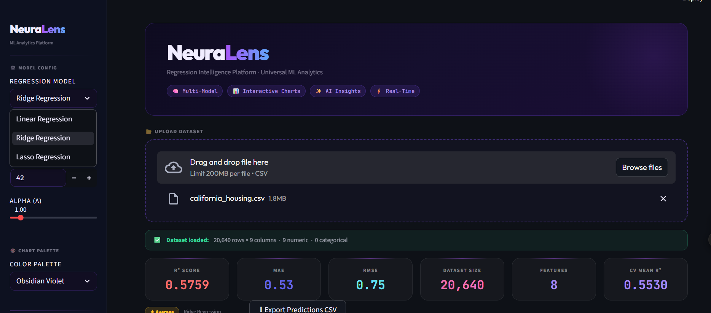
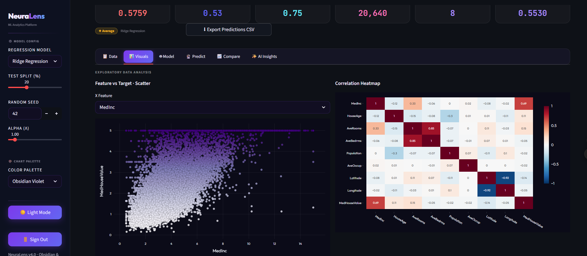
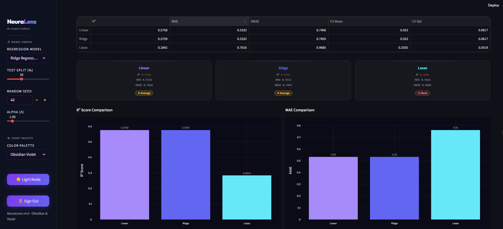
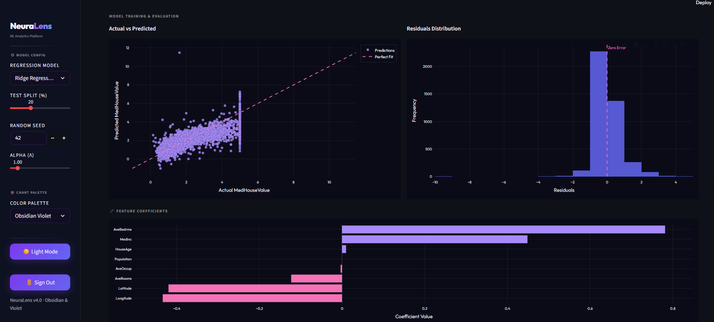

# NeuraLens – AI-Powered Business Analytics Model

NeuraLens is an AI-powered business analytics platform designed to analyze datasets and generate business insights using machine learning and data visualization.

# Features
- Regression model comparison
- Business forecasting
- KPI visualization
- Interactive dashboards
- AI-generated insights

# Technologies Used
- Python
- Streamlit
- Scikit-learn
- Pandas
- Plotly

# Objective
To help businesses make data-driven decisions through predictive analytics and interactive reporting.

# Current Status
The core analytics platform and machine learning forecasting system have been completed. AI-generated insight automation is currently under development.

# Upcoming Features
- AI-generated business insights
- Automated report summaries
- Advanced predictive analytics
- Real-time dashboard enhancements

# Project Screenshots

# Login Page

# Dashboard Overview

#  Visualizations

# Prediction System

# Model Comparison

#  Model Evaluation

  
# Author
Divyansh Pathak
